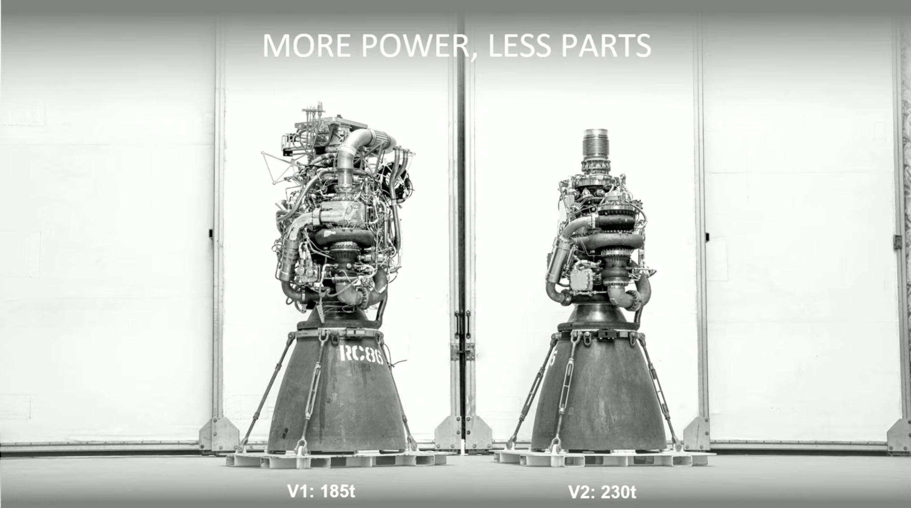

# Architecture

This document provides an overview and a rationale of the architecture of the library.

## Design Goals

The driving quality attributes of this library are:

* **Simplicity**: The code should be as minimal as possible and as decoupled as possible from your domain.
* **Flexibility**: The library should be flexible enough to be used in a variety of scenarios.
* **Extensibility**: The library should be easy to extend.
* **Learnability**: The library should be easy to learn and getting started.

This means that the library tries to minimize 3rd party dependencies as much as possible. "Plain old PHP" objects are used as much as possible without relying on further abstraction and 3rd parties. We believe that this makes the library more robust and easier to understand.

Other libraries may provide more features, but this library aims to provide a solid but **simple** foundation for building event sourced applications. Usually you should start small and then grow. We believe that this library here is perfect to get quickly started but is offering enough extension points to deal with more evolving complex scenarios as well.

> Elon Musk: Delete any part or process you can. You may have to add them back later. In fact, if you do not end up adding back at least 10 percent of them, then you didn't delete enough.

## Ubiquitous Language

This section defines the language used within the domain of event sourcing.

### Event Store

An event store is a repository for domain events. It is a write-only store. Events are appended to the store and are never updated or deleted. The event store is the source of truth for the domain.

### Snapshot Store

A snapshot store is a repository for aggregate snapshots. Snapshots are taken periodically to reduce the number of events that need to be replayed to reconstitute an aggregate.

### Aggregate

An aggregate is a cluster of domain objects that can be treated as a single unit. An aggregate will have one of its component objects be the aggregate root. Any references from outside the aggregate should only go to the aggregate root. The root can thus ensure the integrity of the aggregate as a whole.

An aggregate is also a consistency boundary. The aggregate boundary defines the scope of a transaction. All changes to the aggregate must be done in a single transaction.

### Domain Event

A domain event is a record of something that happened in the domain. It is a fact. It is immutable. It is a record of something that happened. Domain events are produced by aggregates.

### Aggregate Repository

An aggregate repository is a repository for aggregates. It is responsible for loading and saving aggregates. It is also responsible for taking and saving snapshots.

### Event Publisher

An event publisher is responsible for publishing domain events. It is used to publish domain events to the event bus.

## Diagrams

### Package Diagram

The diagram shows the different composer packages and their dependencies. Note that the library does not depend on any 3rd party libraries.

### Flow Diagram

The diagram shows the flow of the data through the different components of the library.

### Entity Diagram

